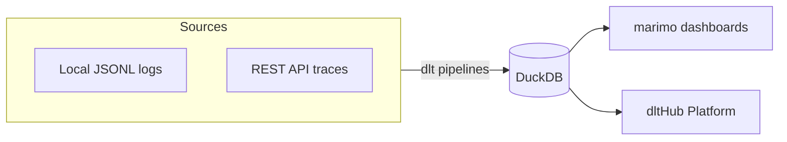

# dtl Library | App

## Overview
Using dtl-library for datasets in an app. In this class, taught by Alena Astrakhantseva from dltHub, we turned those logs into structured tables and dashboards. The dltHub AI workbench, which lets a coding agent build pipelines from natural-language prompts.

The architecture looks like this:
